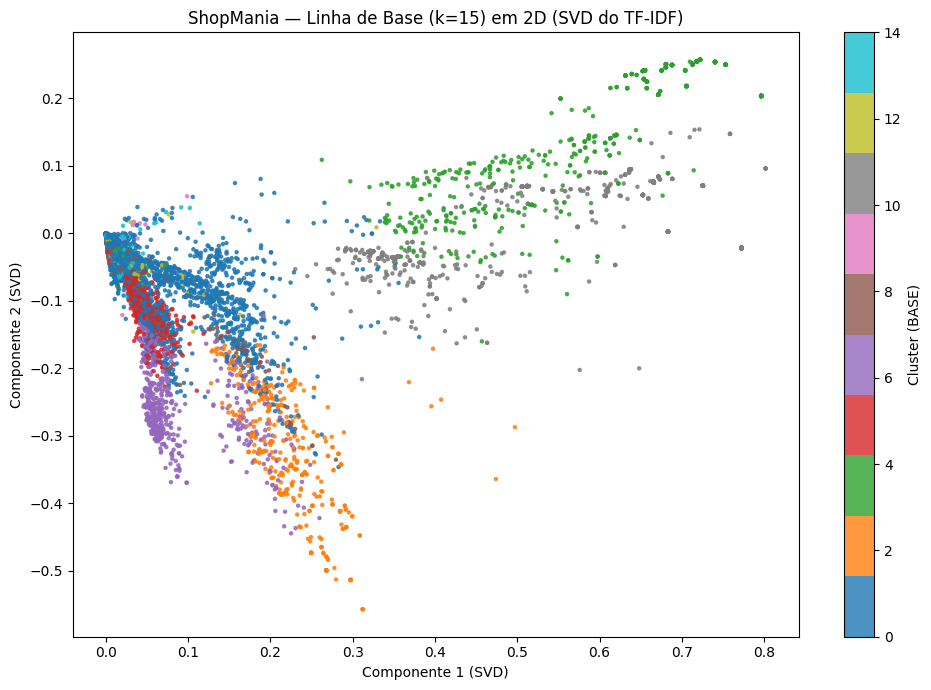

# Clusterização (K-Means) com PCA – ShopMania

## 📌 Objetivo

Aplicar técnicas de **redução de dimensionalidade** para melhorar a clusterização de produtos da base **ShopMania**.  
O foco é incorporar as **categorias (≈230)** como atributos adicionais, reduzir a dimensionalidade com **PCA** e comparar o desempenho com uma linha de base sem PCA.

---

## ⚙️ Pipeline

1. **Leitura e limpeza dos dados**

   - CSV sem cabeçalho.
   - Remoção de nulos e duplicados.
   - Padronização de textos (`lowercase`, remoção de espaços extras).

2. **Representação dos textos**

   - Vetorização **TF-IDF** (títulos dos produtos).
   - Vocabulário limitado a 10.000 termos.
   - Stopwords em português e inglês.

3. **Linha de Base (sem PCA)**

   - Redução de dimensionalidade com **SVD (2D)** apenas para visualização.
   - **MiniBatchKMeans** em espaço TF-IDF.
   - Escolha de _k_ via **métrica da silhueta** (cosine).

4. **Com PCA**

   - Redução inicial do TF-IDF com **TruncatedSVD → 200D**.
   - **One-hot das categorias (230 colunas)**.
   - Empilhamento (texto + categorias).
   - **IncrementalPCA → 50D**.
   - Clusterização com MiniBatchKMeans no espaço reduzido.
   - Silhueta calculada com distância euclidiana.

5. **Comparação de resultados**
   - Silhueta (base vs PCA).
   - Distribuição dos clusters.
   - Visualizações 2D.

---

## 📊 Resultados

### Linha de Base (TF-IDF puro)

- Melhor _k_: **15**
- Silhueta (cosine): **0.0429**
- Silhueta no gráfico (amostra): **0.0516**
- **Distribuição:** clusters bastante desbalanceados, com 50% dos itens concentrados em um único cluster.



---

### PCA (SVD + Categorias + PCA final)

- Melhor _k_: **15**
- Silhueta (euclidean): **0.4405**
- Silhueta no gráfico (amostra): **0.4405**
- **Distribuição:** clusters mais equilibrados (~9–10k itens cada), exceto um cluster maior (~55% dos itens).


---

## 📌 Conclusões

- A linha de base apresenta **silhueta muito baixa**, indicando clusters pouco separados.
- A abordagem com **PCA aumenta a silhueta em quase 10x (0.44 vs 0.04)**, resultando em clusters mais coesos e bem delimitados.
- A inclusão das categorias ajudou a **reforçar a separação semântica**, especialmente após a redução para 50 dimensões.
- Ainda há **um cluster dominante**, possivelmente englobando uma categoria genérica ou ampla, que merece análise qualitativa.

---

## 📂 Exportação

O dataframe pode ser exportado para análise externa:

```python
df[["ID","Produto","Categoria_ID","Categoria_Nome","Cluster_BASE","Cluster_PCA"]].to_csv(
    "shopmania_quantizacao_base_vs_pca.csv", index=False, encoding="utf-8"
)
```
